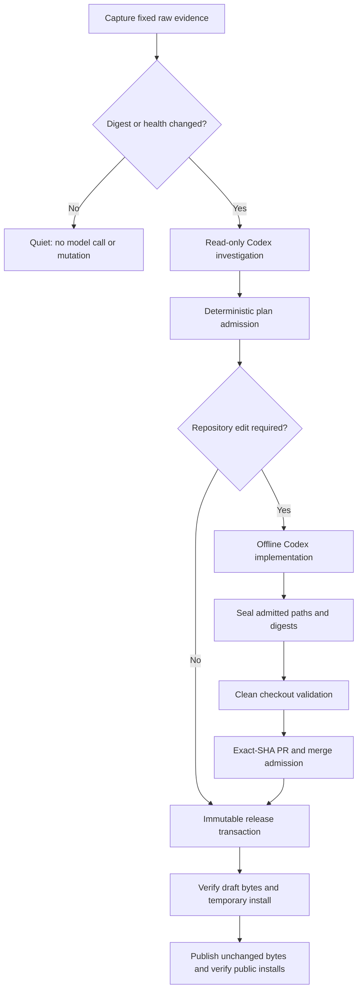
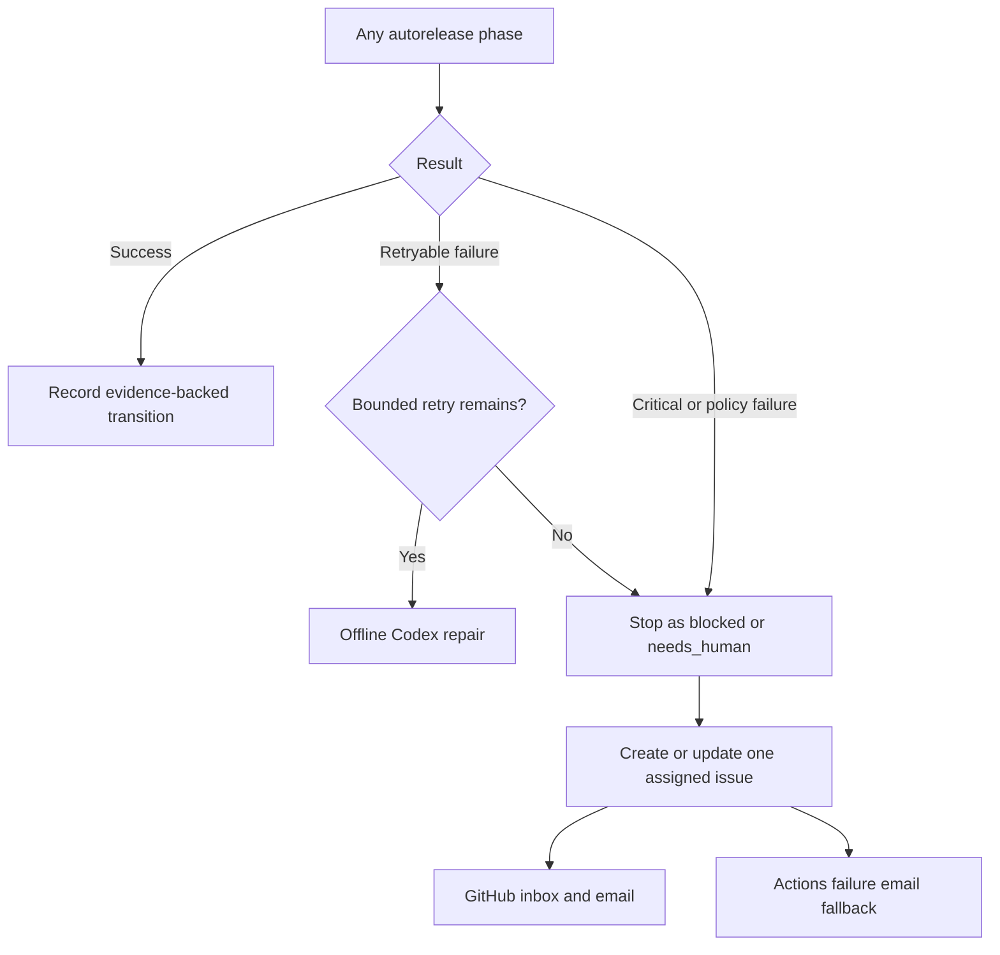

# Autorelease

How this repository detects new upstream PHP releases and lifecycle
changes, prepares bounded repository work, and publishes immutable,
verified macOS 26 arm64 CLI binaries without a human in the loop.

`PHP autorelease watcher` runs daily and can also be dispatched manually. It
captures the raw PHP lifecycle page, release feed, php-src tags, and public
state of both repositories, including response metadata and SHA-256 digests.
The watcher compares only opaque digests and incomplete-event state. An
unchanged healthy day is quiet: it makes no model call and causes no issue,
repository, tag, asset, or release mutation.

When evidence changes, the pinned official Codex Action investigates from a
read-only checkout. Web search is limited to `php.net`, `github.com`, and
`docs.github.com`; material release and lifecycle claims must still resolve to
the retained raw captures. A separate offline Codex invocation may edit only
paths admitted by the evidence-bound plan. It has no GitHub write credential
and cannot change the prompts, contracts, workflows, policy, admission,
sealing, merge, or release controls.



The release transaction is the only component allowed to create an annotated
tag, draft, assets, or publication. It advances one legal state at a time,
reconciles existing state before acting, never rebuilds under an existing tag,
and never overwrites, deletes, or retags a published release. A first release
on a new PHP branch also requires exact-commit `php_bin_ready` and `mise_ready`
records.

Failures use one deduplicated issue per action key, assigned to the username in
`AUTORELEASE_OWNER`. Only a meaningful state, evidence, fingerprint, required
action, or final-result change adds a comment. Critical failures stop mutation.
GitHub Actions failure email is an independent fallback.



Unattended mutation is controlled by
`.github/autorelease-operator.json`. Set `unattendedMutation` to `paused` in a
reviewed protected-path PR to stop implementation, merge, and release while
leaving read-only evidence capture and investigation available. Re-enable it
through another reviewed PR; an incomplete event then resumes only through its
single legal next transition.

Maintainer commands:

```bash
(cd php-bin && ./scripts/test.sh)
(cd mise-php && ./scripts/test.sh)

./php-bin/scripts/verify-autorelease-system \
  --mise-repo ./mise-php \
  --php-bin-sha <exact-php-bin-sha> \
  --mise-php-sha <exact-mise-php-sha> \
  --output ./verification-results

gh workflow run autorelease-e2e.yml \
  --repo bigpixelrocket/php-bin \
  --ref <reviewed-ref> \
  -f php_bin_sha=<exact-php-bin-sha> \
  -f mise_php_sha=<exact-mise-php-sha> \
  -f suite=production-parity

# After the reviewed php-bin commit is merged to main, exercise the actual
# pinned Codex Action and repository API key inside the protected canary environment.
gh workflow run autorelease-e2e.yml \
  --repo bigpixelrocket/php-bin \
  --ref main \
  -f php_bin_sha=<exact-main-php-bin-sha> \
  -f mise_php_sha=<exact-mise-php-sha> \
  -f suite=agent-canary
```

`scripts/test.sh` validates every Codex Action invocation, exact CLI version,
and canonical `config.toml` loading against the reviewed offline contract in
`.github/codex-action-contract.json`. The live agent canary must run from
protected `main`; feature-branch runs cannot enter its credentialed
environment.

Inspect `autorelease-events/`, generated `support-policy.json`, the reviewed
`autorelease/policy-invariants.json`, retained workflow
artifacts, the event issue marker, and `docs/autorelease-verification.md` to
reconstruct a decision. `scripts/snapshot-github-admin-state` captures settings,
variables, and secret names without secret values. Recovery never skips
admission or a failed gate: correct the external dependency or submit a
reviewed protected-control change, then rerun the normal workflow.
