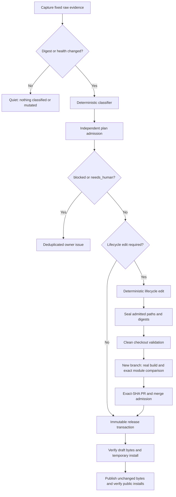
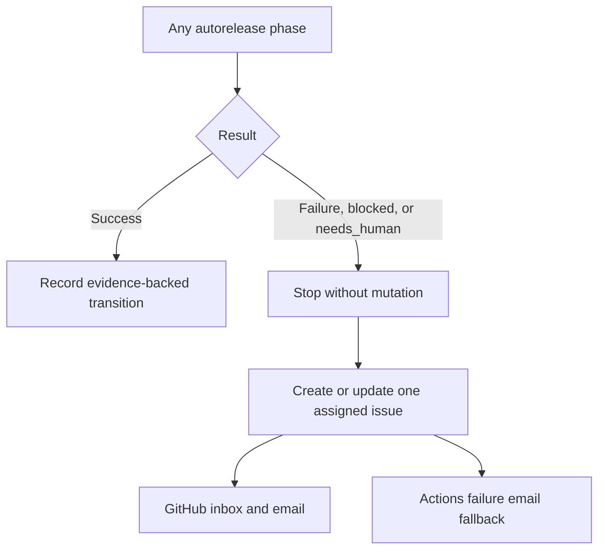

# Autorelease

How this repository detects new upstream PHP releases and lifecycle
changes, prepares bounded repository work, and publishes immutable,
verified macOS 26 arm64 CLI binaries without a human in the loop.

`PHP autorelease watcher` runs daily and can also be dispatched manually. It
captures the raw PHP lifecycle page, release feed, php-src tags, and public
state of both repositories, including response metadata and SHA-256 digests.
The aggregate release feed names only the newest release of each major, so the
watcher also captures one feed per branch in `support-policy.json`
(`php_release_feed_<major>.<minor>`), and a new patch on any maintained branch
is admitted from its own branch feed. The branch set follows the accepted
policy, so a new or retired branch changes what is captured with no code
change. Admission also rejects a `new_patch` or `new_branch` whose version the
captured branch feed or aggregate feed already supersedes with a later patch on
the same branch, so an intermediate release never publishes after its
successor. A php-src tag alone never counts as that later release.
Every php.net source is fetched past the CDN edge cache in front of php.net.
That CDN keeps each URL for hours to 30 days per edge and ignores request cache
headers, so the watcher and the publish job could otherwise read different
snapshots of one feed. Each fetch therefore adds a fresh random
`autorelease_fetch` query parameter; the manifest records the canonical URL,
and evidence identity covers only the capture ID, status, and body digest.
A fetch the CDN still reports as a cache `HIT` fails as an unhealthy capture,
so the bypass cannot stop working silently.
Before releasing, the publish job recaptures all evidence, and every capture
the plan cites must recapture unchanged. A stable release is the one exception:
it ignores release feeds that say nothing about its version, meaning other
branches' feeds and, once the plan cites the version's own branch feed, the
aggregate feed. That branch feed is bound even when uncited, so a release on
another branch never stops this one, while any change to this branch's feed,
the repository state, or other cited context still does. The publish job also
reruns the supersession check on the recaptured feeds.
The GitHub releases captures read every page of the list and digest a
projected body with per-asset download counters and draft releases removed, so
public downloads never register as changed evidence, and the read-only watcher
and the publish job's write token digest the same list however the pages
split; the unprojected items are retained beside the digested body as one
canonical JSON array. The
watcher compares
only opaque digests and incomplete-event state. An unchanged healthy day is
quiet: nothing is classified and nothing causes an issue, repository, tag,
asset, or release mutation.

No model takes part in any step. When evidence changes, the deterministic
classifier (`autorelease/_classifier.py`, run by
`scripts/classify-autorelease-evidence`) turns the retained capture into
exactly one plan in `schemas/autorelease-plan.schema.json`, computing every
evidence digest from the bytes it cites. It applies these rules in order and
stops at the first that applies:

1. **Unhealthy evidence.** A capture that did not return HTTP 200, or a failed
   health check, produces a `blocked` plan: nothing can be proven from it.
2. **An incomplete event record** in `autorelease-events/` is resumed under its
   own action key: a `new_branch` release, a `branch_eol` completion, a
   `new_patch`, or the selected `recipe_rebuild`. A record stopped at
   `blocked` or `needs_human`, or one no deterministic path resumes, produces
   `needs_human`. One exception keeps patches moving: when the only incomplete
   record is a `new_branch` or `branch_eol` at `php_bin_ready`, waiting for
   `mise-php` readiness, a patch due under the next rule goes first and the
   record resumes on a later run.
3. **New patches.** For each maintained branch, oldest first, the version that
   branch's own feed names is a `new_patch` when it is not yet published, not
   older than what already shipped on that branch, and not superseded by a
   later patch the aggregate feed names. The plan cites exactly that branch
   feed value. A maintained branch with no shipped release is never a
   `new_patch`: its first release belongs to `new_branch`, which waits for
   both readiness records, so it produces `needs_human` instead. Admission
   rejects that patch independently. New patches never read the
   supported-versions page, so they go before lifecycle work and keep
   shipping while that page cannot be read.
4. **Lifecycle.** The captured supported-versions page is parsed by a reviewed
   reader that accepts exactly one table shape. A supported branch the policy
   does not maintain is a `new_branch` once the aggregate release feed names
   its first stable release. A maintained branch whose row is marked end of
   life is a `branch_eol` keyed on its security support end date. php.net
   keeps that row for 28 days after the date; a maintained branch with no
   row (for example, one whose window the watcher missed), or an older
   supported branch the policy does not maintain, contradicts the policy and
   produces `needs_human`.
5. **Rebuilds.** The one `rebuildActionKey` the watch decision selected.
6. **No change**, keyed on the manifest's embedded `manifestDigest`.

A body that does not have its reviewed shape (a redesigned lifecycle page, a
feed naming another branch, a releases capture that is not an array) never
leads to a guess: it produces a `blocked` plan, and the watcher raises or
refreshes the deduplicated owner issue for that action key. php.net's
`releases/states.php` is not used.

Admission (`scripts/admit-autorelease-plan`, `autorelease/_admission.py`) then
checks the plan independently. It shares only small pure helpers with the
classifier and re-derives every claim from the capture: the exact field set,
the action key form, evidence digests and locators, release-feed proof and
supersession, that a patch extends a branch that already shipped, the
rebuild selection, allowed paths, and the exact repository and policy
preconditions.

The line between the harness and the product is deliberate. The *harness* is
protected: `scripts/` gates such as `test.sh`, `lib.sh`, `build.sh`,
`package.sh`, and `compare-modules.sh`, the toolchain pins `.spc-version` and
`.spc-sha256`, `tests/`, `autorelease/**`, `schemas/**`, and
`.github/workflows/**`. The *product* is what an admitted lifecycle plan may
write: `support-policy.json` and `expected-modules/`, beside the reviewed
recipe paths `patches/` and `stages/` that change only through a reviewed pull
request. Automation may change what is
built, never what decides whether the build was correct, so the protected
tests are the standing control on every product change. `mise-php` draws the
same line over its own paths; its `AUTORELEASE.md` owns that list.


```mermaid
flowchart TD
  capture["Capture fixed raw evidence"] --> changed{"Digest or health changed?"}
  changed -- "No" --> quiet["Quiet: nothing classified or mutated"]
  changed -- "Yes" --> classify["Deterministic classifier"]
  classify --> admit["Independent plan admission"]
  admit --> stop{"blocked or needs_human?"}
  stop -- "Yes" --> issue["Deduplicated owner issue"]
  stop -- "No" --> edit{"Lifecycle edit required?"}
  edit -- "Yes" --> implement["Deterministic lifecycle edit"]
  implement --> seal["Seal admitted paths and digests"]
  seal --> validate["Clean checkout validation"]
  validate --> build["New branch: real build and exact module comparison"]
  build --> merge["Exact-SHA PR and merge admission"]
  edit -- "No" --> release
  merge --> release["Immutable release transaction"]
  release --> draft["Verify draft bytes and temporary install"]
  draft --> public["Publish unchanged bytes and verify public installs"]
```

The release transaction is the only component allowed to create an annotated
tag, draft, assets, or publication. It advances one legal state at a time,
reconciles existing state before acting, never replaces an existing release's
assets with a fresh build, and never overwrites, deletes, or retags a published
release. A first release on a new PHP branch also requires exact-commit
`php_bin_ready` and `mise_ready` records.

The build and the built binary never run beside the write token. StaticPHP
resolves most sources through the GitHub API and runs third-party build
scripts, so the publish workflow builds, gates, and packages the exact commit
in a separate job whose token can only read contents; that token authenticates
StaticPHP's API calls, which anonymous shared runners would lose to rate
limits. The transaction itself runs in three write-scoped jobs, in order, each
only after the one before succeeded:

1. `release` accepts only the build job's artifact, and checks its service
   digest, exact file set, and the archive and `SHA256SUMS` digests the build
   reported before any transition. Reconciling an existing release reuses the
   release's own assets, so it discards the build and still runs when the build
   failed. It advances to a verified draft, downloads the draft (only the write
   token can see one), and hands the draft bytes, the transaction, and the
   event record to the next jobs as one artifact, by ID and digests.
2. `verify-draft`, a job whose token can only read contents and that holds no
   environment, installs the handed-over draft bytes through a temporary local
   release server.
3. `publish` resumes the handed-over transaction. While the release is still a
   draft it recaptures and revalidates the admitted evidence, supersession
   included, because a rerun of the failed jobs reuses the release job's
   handoff without repeating that job's recapture. Evidence that moved stops
   the run with the verified draft left in place, and the next admitted
   dispatch reuses that draft. It then re-reads the draft
   once more, records `publishing`, and only then makes the release public. A
   run that stops between the publication and its record is therefore still
   known to be possibly live, and reports a warning rather than a failed
   release; so does a rerun that stops early after an earlier attempt already
   published, because the recorded state asks GitHub whether the release is
   public and keeps any earlier attempt's record that it was.
4. `verify-public`, read-only like `verify-draft`, runs fresh public
   exact-version and branch-shorthand installs.
5. `finalize` completes the durable event record through an exact-SHA pull
   request.

Both install jobs pass their read-only token to `mise-php`, whose GitHub API
reads would otherwise be rate limited, and restore no mise cache. Every
artifact a job retains is named per run attempt, so rerunning a failed job
never collides with what an earlier attempt kept, and the transaction state
the failure notification and the email digest read is taken from the newest
attempt that retained one.

Validation deliberately runs the repository's own scripts at the sealed
commit: `autorelease-implement.yml`, and `autorelease-consumer.yml` in
`mise-php`, check out the base SHA, apply the sealed patch, and run
`./scripts/test.sh` from that tree. That is safe precisely because the gates
themselves are protected paths: a patch that touched `autorelease/**`,
`tests/`, or any gate script is rejected at sealing and never reaches
validation, so the code under test can never be the code doing the testing.

A published release whose event record is missing is recovered by the watcher
beside the admitted plan. When that recovery merges, it moves the main the plan
was admitted against, so a plan that would publish, implement an edit, or write
a record against that base waits for the next run instead of failing this one.

Failures use one deduplicated issue per action key, assigned to the username in
`AUTORELEASE_OWNER`. Only a meaningful state, evidence, fingerprint, required
action, or final-result change adds a comment. Critical failures stop mutation.
GitHub Actions failure email is an independent fallback.

`Autorelease email digest` additionally sends one fixed-template TL;DR email
after every completed watcher or publish run, including quiet healthy days, so
silence stops being ambiguous between "no change" and "the schedule stopped".
The template is selected by `email-digest` in `autorelease/control.py` from
retained run state alone and delivered through Resend; no free-form plan prose
reaches the outbound channel, and the workflow skips quietly until the
`RESEND_API_KEY` secret and the email variables exist. Run state that matches
no template — including a corrupt retained artifact — still sends a fallback
summary naming the exact rejection reason, so the channel cannot go silent on
precisely the runs that need a look.

There is no repair phase. A failed classification input, admission, sealing,
validation, build, or merge stops that run and raises the deduplicated owner
issue; the next watcher run retries from the same deterministic state once the
cause is fixed.


```mermaid
flowchart TD
  job["Any autorelease phase"] --> result{"Result"}
  result -- "Success" --> transition["Record evidence-backed transition"]
  result -- "Failure, blocked, or needs_human" --> stop["Stop without mutation"]
  stop --> issue["Create or update one assigned issue"]
  issue --> email["GitHub inbox and email"]
  issue --> actions["Actions failure email fallback"]
```

## Recipe rebuilds

A published release is immutable, so a recipe change reaches an existing PHP
version only as a new rebuild revision: `8.5.9-1`, then `8.5.9-2`. The
watcher decides which one is due:

- The *recipe identity* of a branch is a SHA-256 over the committed tree
  entries of `.spc-sha256`, `.spc-version`, `LICENSE`, `NOTICE`, `patches/`,
  `scripts/build.sh`, `scripts/install-build-deps.sh`, `scripts/install-spc.sh`,
  `scripts/lib.sh`, `scripts/package.sh`, `stages/`, and that branch's own
  `expected-modules/<branch>.txt` at one exact commit (`recipe_identity` in
  `autorelease/_admission.py`). Adding a branch or changing another branch's
  module list rebuilds nothing. The runner image, unpinned Homebrew packages,
  and the workflow definition are not covered, and changing the covered path
  set itself makes every maintained version due once.
- The publish transaction writes `Recipe identity: sha256:<hex>` into the
  notes of every release it creates, computed at the exact commit it builds.
  The notes come back inside the `php_bin_releases` capture, so the identity
  survives across runs with no extra state.
- A published version on a maintained branch is *rebuild due* when its newest
  revision records a different identity, or none. Every release published
  before identities were recorded is therefore due once.
- `pending_recipe_rebuild` in `autorelease/_state.py` picks one due version
  per run: the newest version of each branch first, then older versions,
  newest first. Its revision is one past the highest published revision.
  `watch-decision.json` reports it as `rebuildActionKey`, and the `rebuild_due`
  trigger runs the classifier even on an otherwise quiet day.
- Admission re-derives the same selection from the same capture, commit, and
  policy. A `recipe_rebuild` plan must name exactly that key, set
  `releaseIntent.version` to `<version>-<n>`, require no edits, allow no paths,
  and cite the `php_bin_releases` tag it supersedes. A `no_change` plan is
  rejected while a rebuild is due, so recorded evidence can never leave one
  pending.
- The admitted rebuild goes straight to the publish transaction. Each
  publication changes `php_bin_releases`, so the next run selects the next
  rebuild until none is due. Incomplete records, new branches, EOL, and new
  patches take priority in the classifier.
- Selection has no skip: a version whose rebuild keeps failing is selected
  again on every run and holds back the rebuilds ordered after it until the
  recipe is fixed. The `php_bin_releases` capture reads every page of the
  releases list, up to 20 pages of 100, and fails as unhealthy rather than
  truncate a longer list.

## Unattended lifecycle

Adding or retiring a PHP branch takes zero human input. Nothing in the system
is anchored to a particular major or minor: the action keys, version
validators, and policy files all accept any `<major>.<minor>`, so PHP `8.6`,
`9.0`, and `10.0` all travel the same path with no code change.

When upstream evidence first shows a new branch, `autorelease-implement.yml`
runs `scripts/apply-autorelease-plan`: it copies the newest maintained
branch's `expected-modules/<branch>.txt` byte for byte (the only per-branch
recipe input; `stages/` and `patches/` are shared by every branch) and regenerates `support-policy.json` with the branch added, bound to
the plan's evidence digests and action key and accepted at the capture time.
The sealed edit is validated in a clean checkout, and the branch's first
release is then built for real at the validated commit. Only an exact module
comparison pass lets it merge. When the new branch builds a different module
set, the run stops without merging and the owner issue for the
`new_branch:<branch>` key states the exact missing (`-`) and unexpected (`+`)
modules; a human corrects `expected-modules/<branch>.txt` by pull request, and
the next watcher run retries with that list, which the edit never overwrites.
Until then each watcher run with no patch due retries the same build and
fails the same way; patches on maintained branches go first and never wait
for it.
`mise-php` then regenerates `support-snapshot.json` and `lib/policy.lua`
from the merged policy with its own deterministic scripts. The readiness and
event records then merge on their own: `autorelease-events/`, `autorelease-state/`, and `mise-php`'s
`readiness/` sit outside CODEOWNERS precisely so their exact-SHA automation
PRs satisfy branch protection without a reviewer, while every protected
control still cannot. Publication waits only on machine facts — matching
`php_bin_ready` and `mise_ready` records at exact commits. The `mise_ready`
record names the mise-php synchronization commit it validated, and the record
itself merges on top of it, so the publish job requires the captured mise-php
`main` to contain that commit and verifies installs with the plugin checked
out at exactly it.

Retirement is the mirror image and equally unattended. A maintained branch
whose supported-versions row is marked end of life becomes
`branch_eol:<branch>:<security support end>`; the lifecycle edit removes it
from `support-policy.json` and leaves its module list in place. That stops
new builds and publication for the branch and delists it from
`mise ls-remote` and branch-shorthand resolution. It removes nothing: every
release already published stays immutable, and an exact version such as
`8.2.32` installs exactly as before, indefinitely.

Unattended mutation is controlled by
`.github/autorelease-operator.json`. Set `unattendedMutation` to `paused` in a
reviewed protected-path PR to stop implementation, merge, and release while
leaving read-only evidence capture and classification available. Re-enable it
through another reviewed PR; an incomplete event then resumes only through its
single legal next transition.

Maintainer commands:

```bash
(cd php-bin && ./scripts/test.sh)
(cd mise-php && ./scripts/test.sh)

./php-bin/scripts/verify-autorelease-system \
  --mise-repo ./mise-php \
  --php-bin-sha <exact-php-bin-sha> \
  --mise-php-sha <exact-mise-php-sha> \
  --output ./verification-results

gh workflow run autorelease-e2e.yml \
  --repo bigpixelrocket/php-bin \
  --ref <reviewed-ref> \
  -f php_bin_sha=<exact-php-bin-sha> \
  -f mise_php_sha=<exact-mise-php-sha> \
  -f suite=production-parity
```

The other suites are `notification-canary`, which creates, replays, and closes
one namespaced issue, and `live-canary`, which installs an already published
version through `mise-php` (`-f live_version=<version>`).

To reproduce a classification offline, run the classifier and admission
against a retained watcher artifact (`gh run download <run-id> --name
autorelease-investigation-<run-id>`):

```bash
./scripts/classify-autorelease-evidence \
  --manifest <artifact>/evidence/evidence-manifest.json \
  --preconditions <artifact>/preconditions.json \
  --events autorelease-events \
  --output plan.json
```

Inspect `autorelease-events/`, generated `support-policy.json`, the reviewed
`autorelease/policy-invariants.json`, retained workflow artifacts, and the
event issue marker to reconstruct a decision. `scripts/verify-autorelease-system`
writes `autorelease-verification.json` and `autorelease-verification.md` into
its `--output` directory; both are per-run artifacts, not checked-in files.

`scripts/snapshot-github-admin-state` captures settings,
variables, and secret names without secret values. Recovery never skips
admission or a failed gate: correct the external dependency or submit a
reviewed protected-control change, then rerun the normal workflow.
