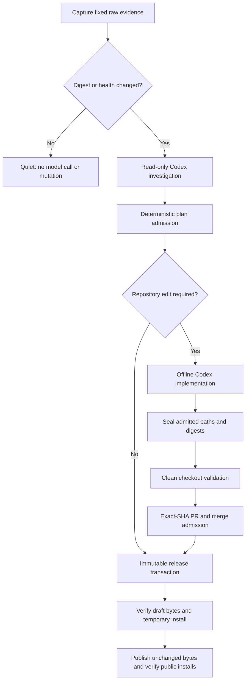
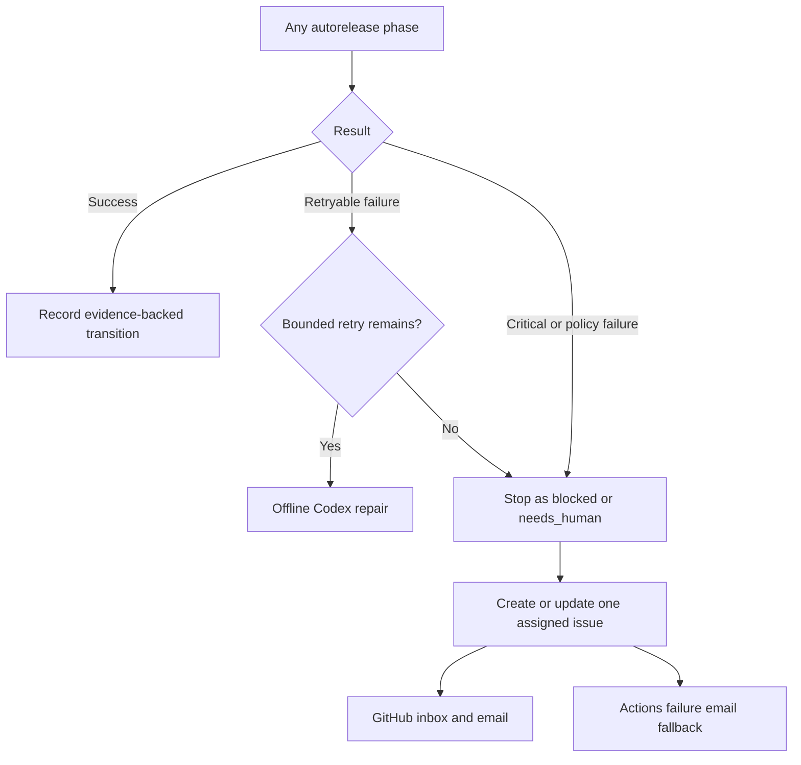

# Autorelease

How this repository detects new upstream PHP releases and lifecycle
changes, prepares bounded repository work, and publishes immutable,
verified macOS 26 arm64 CLI binaries without a human in the loop.

`PHP autorelease watcher` runs daily and can also be dispatched manually. It
captures the raw PHP lifecycle page, release feed, php-src tags, and public
state of both repositories, including response metadata and SHA-256 digests.
The aggregate release feed names only the newest release of each major, so the
watcher also captures one feed per branch in `support-policy.json`
(`php_release_feed_<major>.<minor>`), and a new patch on any maintained branch
is admitted from its own branch feed. The branch set follows the accepted
policy, so a new or retired branch changes what is captured with no code
change. Admission also rejects a `new_patch` or `new_branch` whose version the
captured branch feed or aggregate feed already supersedes with a later patch on
the same branch, so an intermediate release never publishes after its
successor. A php-src tag alone never counts as that later release.
Every php.net source is fetched past the CDN edge cache in front of php.net.
That CDN keeps each URL for hours to 30 days per edge and ignores request cache
headers, so the watcher and the publish job could otherwise read different
snapshots of one feed. Each fetch therefore adds a fresh random
`autorelease_fetch` query parameter; the manifest records the canonical URL,
and evidence identity covers only the capture ID, status, and body digest.
A fetch the CDN still reports as a cache `HIT` fails as an unhealthy capture,
so the bypass cannot stop working silently.
Before releasing, the publish job recaptures all evidence, and every capture
the plan cites must recapture unchanged. A stable release is the one exception:
it ignores release feeds that say nothing about its version, meaning other
branches' feeds and, once the plan cites the version's own branch feed, the
aggregate feed. That branch feed is bound even when uncited, so a release on
another branch never stops this one, while any change to this branch's feed,
the repository state, or other cited context still does. The publish job also
reruns the supersession check on the recaptured feeds.
The GitHub releases captures digest a projected body with per-asset download
counters and draft releases removed, so public downloads never register as
changed evidence, and the read-only watcher and the publish job's write token
digest the same list; the unprojected bytes are retained beside the digested
body. The watcher compares
only opaque digests and incomplete-event state. An unchanged healthy day is
quiet: it makes no model call and causes no issue, repository, tag, asset, or
release mutation.

When evidence changes, the pinned official Codex Action investigates from a
read-only checkout. Web search is limited to `php.net`, `github.com`, and
`docs.github.com`; material release and lifecycle claims must still resolve to
the retained raw captures. A separate offline Codex invocation may edit only
paths admitted by the evidence-bound plan. It has no GitHub write credential
and cannot change the prompts, contracts, workflows, policy, admission,
sealing, merge, or release controls.

The line between the two is deliberate. The *harness* is protected: `scripts/`
gates such as `test.sh`, `lib.sh`, `build.sh`, `package.sh`, and
`compare-modules.sh`, the toolchain pins `.spc-version` and `.spc-sha256`,
`tests/`, `autorelease/**`, `schemas/**`, `.github/workflows/**`, and the
pinned Codex prompts and contracts under `.github/`. The *product* is
agent-admissible: `patches/`, `stages/`, `craft.yml`, `extensions.txt`, and
`expected-modules/`. A model may change what is built, never what decides
whether the build was correct, so the protected tests are the standing control
on every product change. `mise-php` draws the same line over its own paths;
its `AUTORELEASE.md` owns that list.


```mermaid
flowchart TD
  capture["Capture fixed raw evidence"] --> changed{"Digest or health changed?"}
  changed -- "No" --> quiet["Quiet: no model call or mutation"]
  changed -- "Yes" --> investigate["Read-only Codex investigation"]
  investigate --> admit["Deterministic plan admission"]
  admit --> edit{"Repository edit required?"}
  edit -- "Yes" --> implement["Offline Codex implementation"]
  implement --> seal["Seal admitted paths and digests"]
  seal --> validate["Clean checkout validation"]
  validate --> merge["Exact-SHA PR and merge admission"]
  edit -- "No" --> release
  merge --> release["Immutable release transaction"]
  release --> draft["Verify draft bytes and temporary install"]
  draft --> public["Publish unchanged bytes and verify public installs"]
```

The release transaction is the only component allowed to create an annotated
tag, draft, assets, or publication. It advances one legal state at a time,
reconciles existing state before acting, never replaces an existing release's
assets with a fresh build, and never overwrites, deletes, or retags a published
release. A first release on a new PHP branch also requires exact-commit
`php_bin_ready` and `mise_ready` records.

The build never runs beside the write token. StaticPHP resolves most sources
through the GitHub API and runs third-party build scripts, so the publish
workflow builds, gates, and packages the exact commit in a separate job whose
token can only read contents; that token authenticates StaticPHP's API calls,
which anonymous shared runners would lose to rate limits. The release job holds
the write token, accepts only that job's artifact, and checks its service
digest, exact file set, and the archive and `SHA256SUMS` digests the build
reported before any transition. Reconciling an existing release reuses the
release's own assets, so it discards the build and still runs when the build
failed. The release job still runs the built binary to verify the draft and
public installs, so those steps hold no token, and its mise setup gets no
token and restores no cache.

Validation deliberately runs the repository's own scripts at the sealed model
commit: `autorelease-implement.yml`, and `autorelease-consumer.yml` in
`mise-php`, check out the base SHA, apply the sealed patch, and run
`./scripts/test.sh` from that tree. That is safe precisely because the gates
themselves are protected paths: a model patch that touched `autorelease/**`,
`tests/`, or any gate script is rejected at admission and never reaches
validation, so the code under test can never be the code doing the testing.

Failures use one deduplicated issue per action key, assigned to the username in
`AUTORELEASE_OWNER`. Only a meaningful state, evidence, fingerprint, required
action, or final-result change adds a comment. Critical failures stop mutation.
GitHub Actions failure email is an independent fallback.

`Autorelease email digest` additionally sends one fixed-template TL;DR email
after every completed watcher or publish run, including quiet healthy days, so
silence stops being ambiguous between "no change" and "the schedule stopped".
The template is selected by `email-digest` in `autorelease/control.py` from
retained run state alone and delivered through Resend; no model-authored prose
reaches the outbound channel, and the workflow skips quietly until the
`RESEND_API_KEY` secret and the email variables exist. Run state that matches
no template — including a corrupt retained artifact — still sends a fallback
summary naming the exact rejection reason, so the channel cannot go silent on
precisely the runs that need a look.


```mermaid
flowchart TD
  job["Any autorelease phase"] --> result{"Result"}
  result -- "Success" --> transition["Record evidence-backed transition"]
  result -- "Retryable failure" --> retry{"Bounded retry remains?"}
  retry -- "Yes" --> repair["Offline Codex repair"]
  retry -- "No" --> blocked["Stop as blocked or needs_human"]
  result -- "Critical or policy failure" --> blocked
  blocked --> issue["Create or update one assigned issue"]
  issue --> email["GitHub inbox and email"]
  issue --> actions["Actions failure email fallback"]
```

## Recipe rebuilds

A published release is immutable, so a recipe change reaches an existing PHP
version only as a new rebuild revision: `8.5.9-1`, then `8.5.9-2`. The
watcher, not the model, decides which one is due:

- The *recipe identity* of a branch is a SHA-256 over the committed tree
  entries of `.spc-sha256`, `.spc-version`, `LICENSE`, `NOTICE`, `patches/`,
  `scripts/build.sh`, `scripts/install-build-deps.sh`, `scripts/install-spc.sh`,
  `scripts/lib.sh`, `scripts/package.sh`, `stages/`, and that branch's own
  `expected-modules/<branch>.txt` at one exact commit (`recipe_identity` in
  `autorelease/_admission.py`). Adding a branch or changing another branch's
  module list rebuilds nothing. The runner image, unpinned Homebrew packages,
  and the workflow definition are not covered, and changing the covered path
  set itself makes every maintained version due once.
- The publish transaction writes `Recipe identity: sha256:<hex>` into the
  notes of every release it creates, computed at the exact commit it builds.
  The notes come back inside the `php_bin_releases` capture, so the identity
  survives across runs with no extra state.
- A published version on a maintained branch is *rebuild due* when its newest
  revision records a different identity, or none. Every release published
  before identities were recorded is therefore due once.
- `pending_recipe_rebuild` in `autorelease/_state.py` picks one due version
  per run: the newest version of each branch first, then older versions,
  newest first. Its revision is one past the highest published revision.
  `watch-decision.json` reports it as `rebuildActionKey`, and the `rebuild_due`
  trigger calls the model even on an otherwise quiet day.
- Admission re-derives the same selection from the same capture, commit, and
  policy. A `recipe_rebuild` plan must name exactly that key, set
  `releaseIntent.version` to `<version>-<n>`, require no edits, allow no paths,
  and cite the `php_bin_releases` tag it supersedes. A `no_change` plan is
  rejected while a rebuild is due, so recorded evidence can never leave one
  pending.
- The admitted rebuild goes straight to the publish transaction. Each
  publication changes `php_bin_releases`, so the next run selects the next
  rebuild until none is due. New patches, new branches, EOL, and
  reconciliation take priority in the investigation.
- Selection has no skip: a version whose rebuild keeps failing is selected
  again on every run and holds back the rebuilds ordered after it until the
  recipe is fixed. The `php_bin_releases` capture reads the newest 100
  releases, so a version whose releases all fall beyond that page is not
  considered for a rebuild.

## Unattended lifecycle

Adding or retiring a PHP branch takes zero human input. Nothing in the system
is anchored to a particular major or minor: the action keys, version
validators, and policy files all accept any `<major>.<minor>`, so PHP `8.6`,
`9.0`, and `10.0` all travel the same path with no code change.

When upstream evidence first shows a new branch, the admitted implementation
patch adds `expected-modules/<branch>.txt` and whatever recipe inputs the
staged S0–S4 builds need, `support-policy.json` regenerates from the accepted
policy, and `mise-php` regenerates `support-snapshot.json` and
`lib/policy.lua` from it. The readiness and event records then merge on their
own: `autorelease-events/`, `autorelease-state/`, and `mise-php`'s
`readiness/` sit outside CODEOWNERS precisely so their exact-SHA automation
PRs satisfy branch protection without a reviewer, while every protected
control still cannot. Publication waits only on machine facts — matching
`php_bin_ready` and `mise_ready` records at exact commits.

Retirement is the mirror image and equally unattended. Captured EOL evidence
stops new builds and publication for that branch and delists it from
`mise ls-remote` and branch-shorthand resolution. It removes nothing: every
release already published stays immutable, and an exact version such as
`8.2.32` installs exactly as before, indefinitely.

Unattended mutation is controlled by
`.github/autorelease-operator.json`. Set `unattendedMutation` to `paused` in a
reviewed protected-path PR to stop implementation, merge, and release while
leaving read-only evidence capture and investigation available. Re-enable it
through another reviewed PR; an incomplete event then resumes only through its
single legal next transition.

Maintainer commands:

```bash
(cd php-bin && ./scripts/test.sh)
(cd mise-php && ./scripts/test.sh)

./php-bin/scripts/verify-autorelease-system \
  --mise-repo ./mise-php \
  --php-bin-sha <exact-php-bin-sha> \
  --mise-php-sha <exact-mise-php-sha> \
  --output ./verification-results

gh workflow run autorelease-e2e.yml \
  --repo bigpixelrocket/php-bin \
  --ref <reviewed-ref> \
  -f php_bin_sha=<exact-php-bin-sha> \
  -f mise_php_sha=<exact-mise-php-sha> \
  -f suite=production-parity

# After the reviewed php-bin commit is merged to main, exercise the actual
# pinned Codex Action and repository API key inside the protected canary environment.
gh workflow run autorelease-e2e.yml \
  --repo bigpixelrocket/php-bin \
  --ref main \
  -f php_bin_sha=<exact-main-php-bin-sha> \
  -f mise_php_sha=<exact-mise-php-sha> \
  -f suite=agent-canary
```

`scripts/test.sh` validates every Codex Action invocation, exact CLI version,
and canonical `config.toml` loading against the reviewed offline contract in
`.github/codex-action-contract.json`. The live agent canary must run from
protected `main`; feature-branch runs cannot enter its credentialed
environment.

Inspect `autorelease-events/`, generated `support-policy.json`, the reviewed
`autorelease/policy-invariants.json`, retained workflow artifacts, and the
event issue marker to reconstruct a decision. `scripts/verify-autorelease-system`
writes `autorelease-verification.json` and `autorelease-verification.md` into
its `--output` directory; both are per-run artifacts, not checked-in files.

`scripts/snapshot-github-admin-state` captures settings,
variables, and secret names without secret values. Recovery never skips
admission or a failed gate: correct the external dependency or submit a
reviewed protected-control change, then rerun the normal workflow.
