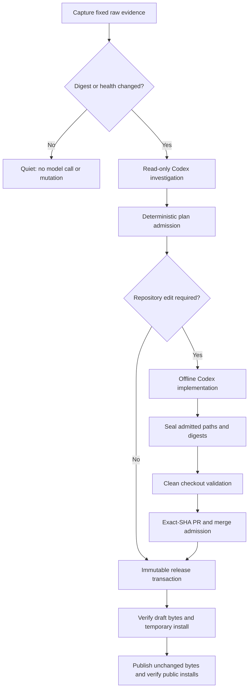
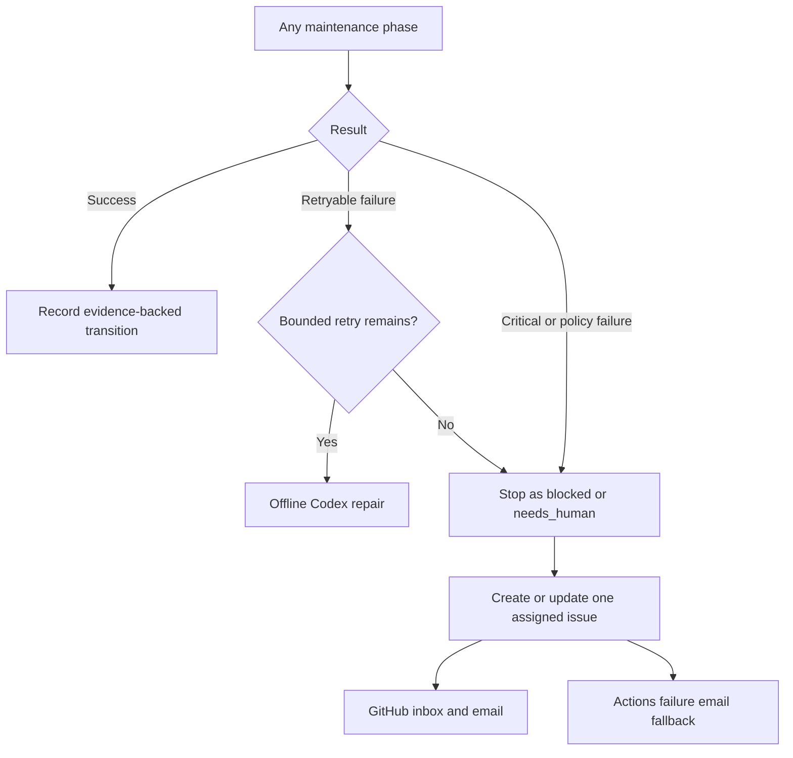

# php-bin

Reproducible, fat static PHP CLI binaries for Apple Silicon Macs.

This repository owns the build recipe and release contract consumed by
[`bigpixelrocket/mise-php`](https://github.com/bigpixelrocket/mise-php). It does
not manage PHP versions on a developer's machine and it does not provide a web
server, DNS, databases, or a desktop UI.

## Status

Public macOS arm64 releases are available for every maintained PHP branch:
[8.2.32](https://github.com/bigpixelrocket/php-bin/releases/tag/8.2.32),
[8.3.32](https://github.com/bigpixelrocket/php-bin/releases/tag/8.3.32),
[8.4.23](https://github.com/bigpixelrocket/php-bin/releases/tag/8.4.23), and
[8.5.8](https://github.com/bigpixelrocket/php-bin/releases/tag/8.5.8).
Each release is rebuilt on macOS 26 arm64 and published only after its exact
module baseline and deployment target checks pass.

## Guarded automatic maintenance

`PHP maintenance watcher` runs daily and can also be dispatched manually. It
captures the raw PHP lifecycle page, release feed, php-src tags, and public
state of both repositories, including response metadata and SHA-256 digests.
The watcher compares only opaque digests and incomplete-event state. An
unchanged healthy day is quiet: it makes no model call and causes no issue,
repository, tag, asset, or release mutation.

When evidence changes, the pinned official Codex Action investigates from a
read-only checkout. Web search is limited to `php.net`, `github.com`, and
`docs.github.com`; material release and lifecycle claims must still resolve to
the retained raw captures. A separate offline Codex invocation may edit only
paths admitted by the evidence-bound plan. It has no GitHub write credential
and cannot change the prompts, contracts, workflows, policy, admission,
sealing, merge, or release controls.



The release transaction is the only component allowed to create an annotated
tag, draft, assets, or publication. It advances one legal state at a time,
reconciles existing state before acting, never rebuilds under an existing tag,
and never overwrites, deletes, or retags a published release. A first release
on a new PHP branch also requires exact-commit `php_bin_ready` and `mise_ready`
records.

Failures use one deduplicated issue per action key, assigned to the username in
`MAINTENANCE_OWNER`. Only a meaningful state, evidence, fingerprint, required
action, or final-result change adds a comment. Critical failures stop mutation.
GitHub Actions failure email is an independent fallback.



Unattended mutation is controlled by
`.github/maintenance-operator.json`. Set `unattendedMutation` to `paused` in a
reviewed protected-path PR to stop implementation, merge, and release while
leaving read-only evidence capture and investigation available. Re-enable it
through another reviewed PR; an incomplete event then resumes only through its
single legal next transition.

Maintainer commands:

```bash
(cd php-bin && ./scripts/test.sh)
(cd mise-php && ./scripts/test.sh)

./php-bin/scripts/verify-maintenance-system \
  --mise-repo ./mise-php \
  --php-bin-sha <exact-php-bin-sha> \
  --mise-php-sha <exact-mise-php-sha> \
  --output ./verification-results

gh workflow run maintenance-e2e.yml \
  --repo bigpixelrocket/php-bin \
  --ref <reviewed-ref> \
  -f php_bin_sha=<exact-php-bin-sha> \
  -f mise_php_sha=<exact-mise-php-sha> \
  -f suite=production-parity
```

Inspect `maintenance-events/`, `support-policy.json`, retained workflow
artifacts, the event issue marker, and `docs/maintenance-verification.md` to
reconstruct a decision. `scripts/snapshot-github-admin-state` captures settings,
variables, and secret names without secret values. Recovery never skips
admission or a failed gate: correct the external dependency or submit a
reviewed protected-control change, then rerun the normal workflow.

## Release contract

Published releases use a PHP version tag such as `8.4.5`, or `8.4.5-1` for a
recipe-only rebuild. Each release contains:

```text
php-<tag>-cli-macos-aarch64.tar.gz
SHA256SUMS
```

The archive layout is stable:

```text
bin/php
```

## Build locally

Requirements: an Apple Silicon Mac running macOS 26 or newer, Homebrew, Xcode
command-line tools, and enough free disk space for a full StaticPHP build.

```bash
scripts/install-build-deps.sh
scripts/install-spc.sh
scripts/build.sh 8.4 s0
scripts/compare-modules.sh .build/8.4/s0/buildroot/bin/php stages/s0.txt subset
```

Advance through `s1`, `s2`, `s3`, and `s4`. Stage `s4` runs the exact comparison
against `expected-modules/8.4.txt`:

```bash
scripts/build.sh 8.4 s4
scripts/compare-modules.sh \
  .build/8.4/s4/buildroot/bin/php \
  expected-modules/8.4.txt exact
```

When the exact check is green, package the binary with its full PHP patch
version:

```bash
scripts/package.sh .build/8.4/s4/buildroot/bin/php 8.4.5
```

## Publishing and recovery policy

Only branches maintained upstream are discoverable and eligible for new
publication. Exact historical versions remain installable while their
immutable assets exist. Protected controls always change through reviewed pull
requests.

### New patch on a supported branch

For an ordinary stable patch, the admitted no-edit intent goes directly to
`Guarded PHP release transaction`; no implementation job or PR is created. A
recipe change uses a sealed automation PR first. Never move an existing tag or
replace a published asset. Use a rebuild tag such as `8.5.9-1` when the PHP
patch is unchanged but the recipe changes the bytes.

### New PHP branch

For a new branch such as PHP `8.6`:

Codex prepares bounded changes in both repositories. Staged S0–S4 builds must
resolve extension compatibility and exact-module drift without weakening a
gate. Publication waits for readiness records tied to the same action key,
evidence digests, php-bin policy commit, and exact repository commits.

A new major such as PHP `9.0` follows the same process, but every validator and
parser anchored to PHP 8 must be reviewed explicitly.

### End-of-life branches

When captured upstream evidence shows EOL, publication for that branch stops
and coordinated admitted changes remove its shorthand and active build support.
Existing GitHub Releases remain immutable and exact historical installation
continues to work.

Runtime packages required by particular extensions are documented in
[`docs/runtime-deps.md`](docs/runtime-deps.md). The build and release workflow
is documented in [`docs/release-process.md`](docs/release-process.md).

## Supported target

- macOS 26 (Tahoe) or newer
- arm64 / aarch64
- Currently supported PHP branches: 8.2 through 8.5
- CLI SAPI

Other operating systems, Intel Macs, and PHP 7.x are outside the v1 target.

## Contributing and security

See [`CONTRIBUTING.md`](CONTRIBUTING.md) before changing recipes. Report
security issues using [`SECURITY.md`](SECURITY.md), not a public issue.

## License

Build code is MIT licensed. Redistributed binaries contain PHP and third-party
software under their own licenses; see [`NOTICE`](NOTICE).
